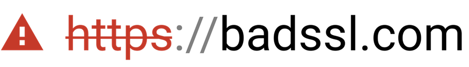

<center>
  <a href="https://badssl.com/">
    
  </a>
</center>

Visit [`badssl.com`](https://badssl.com/) for a list of test subdomains, including:

- [`self-signed.badssl.com`](https://self-signed.badssl.com)
- [`expired.badssl.com`](https://expired.badssl.com)
- [`mixed.badssl.com`](https://mixed.badssl.com)
- [`rc4.badssl.com`](https://rc4.badssl.com)
- [`hsts.badssl.com`](https://hsts.badssl.com)

## Server Setup

Stock Ubuntu VM, DNS A records for `badssl.com.` and `*.badssl.com.` pointing to the VM.

### Testing and development

1. Follow the instructions to [install Docker.](https://www.docker.com/get-docker)

2. Clone into the badssl repo by running `git clone https://github.com/chromium/badssl.com && cd badssl.com`.
 
3. In order to access the various badssl subdomains locally you will need to add them to your [system hosts file](https://bencane.com/2013/10/29/managing-dns-locally-with-etchosts/). Run `make list-hosts` and copy and paste the output into `/etc/hosts`. 

4. Start Docker by running `make serve`.

5. You can now navigate to `badssl.test` in your browser, and you should see a certificate error.

6. The badssl root certificate is at `certs/sets/test/gen/crt/ca-root.crt`. In order to get the rest of the badssl subdomains working, you will need to add this to your machine's list of trusted certificates.
    - On `macOS`, run:
    
      ```
      sudo security add-trusted-cert -d -r trustRoot \
        -k /Library/Keychains/System.keychain certs/sets/test/gen/crt/ca-root.crt
      ```

7. In order to preserve the root certificate even after running `make clean`, run:

```
cd certs/sets/test
mkdir -p pregen/crt pregen/key
cp gen/crt/ca-root.crt pregen/crt/ca-root.crt
cp gen/key/ca-root.key pregen/key/ca-root.key
``` 

## Acknowledgments

badssl.com is hosted on Google Cloud infrastructure and co-maintained by:

- [April King](https://github.com/april), Mozilla Firefox
- [Lucas Garron](https://github.com/lgarron), Google Chrome

Several public badssl.com certificates required special issuance processes. Most certificates were graciously issued for free, thanks to help from:

- [Vincent Lynch](https://twitter.com/vtlynch), [The SSL Store](https://www.thesslstore.com/) (`sha1-2016`, `sha1-2017`)
- [Richard Barnes](https://twitter.com/rlbarnes), Mozilla (`1000-sans`, `10000-sans`)
- [Clint Wilson](https://twitter.com/clintw_), [DigiCert](https://www.digicert.com/) (most wildcards)
- [Andrew Ayer](https://github.com/agwa), [SSLMate](https://sslmate.com/) (`invalid-expected-sct`)
- [Rob Stradling](https://github.com/robstradling), [Comodo](https://www.comodo.com/) (`1000-sans`, `10000-sans`, `no-subject`, `no-common-name`, `sha1-intermediate`, `ѕрооғ`)

Various subdomains and test pages are also implemented by [external contributors](https://github.com/chromium/badssl.com/graphs/contributors).

## Disclaimer

`badssl.com` is meant for *manual* testing of security UI in web clients.

Most subdomains are likely to have stable functionality, but anything *could* change without notice. If you would like a documented guarantee for a particular use case, please file an issue. (Alternatively, you could make a fork and host your own copy.)

badssl.com is not an official Google product. It is offered "AS-IS" and without any warranties.
